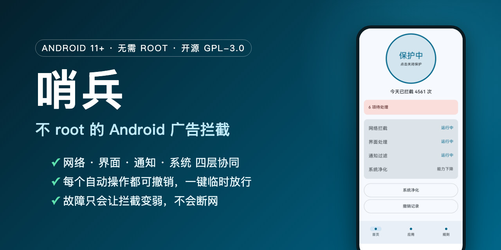

<p align="center"></p>

<p align="center">
<a href="https://github.com/BBbinlei/sentinel-adblock/releases/latest"></a>


</p>

<p align="center">
<a href="https://github.com/BBbinlei/sentinel-adblock/releases/latest/download/sentinel-adblock.apk"><b>⬇ 下载 APK</b></a> ·
<a href="https://bbbinlei.github.io/sentinel-adblock/">介绍网页</a> ·
<a href="https://github.com/BBbinlei/sentinel-adblock/releases">所有版本</a>
</p>

# 哨兵（Sentinel AdBlock）

一个**不需要 root** 的 Android 广告拦截 App，面向 ColorOS（OPPO / OnePlus）实机开发和验证。它把「网络、界面、通知、系统」四层手段组合起来，覆盖开屏、弹窗、激励视频、摇一摇跳转、营销通知等 27 种常见广告套路，同时尽量不影响原 App 的正常使用。

> 当前为 **v0.1.0 早期版本**：已在 OPPO 实机上验证，其他机型/系统未充分测试，欢迎反馈。

## 特性

| 层 | 做什么 |
|---|---|
| 网络拦截（VPN） | 本机 VPN 按域名拦截广告 SDK 请求，不解密 HTTPS |
| 界面处理（无障碍） | 自动点「跳过」、关弹窗、处理激励视频与跳转回退 |
| 通知过滤 | 过滤系统自带 App 的营销通知 |
| 系统净化（Shizuku，可选） | 关闭 ColorOS 内置的推荐/广告项，每步可撤销 |

- **家人友好**：首页一个大开关，每个 App 只有「关 / 标准 / 强力」三档。
- **可撤销**：每个自动操作都有记录，出问题点两下即可临时放行 24 小时。
- **新 App 观察期**：新装 App 先观察 3 天再拦截，降低误伤。
- **安全兜底**：任何故障只会让拦截变弱，不会让手机断网或 App 无法使用。
- 无账号、无云端服务器，规则全部本地处理。

## 安装

1. 在 [Releases](https://github.com/BBbinlei/sentinel-adblock/releases/latest) 下载 `sentinel-adblock.apk` 并安装（需允许安装未知来源应用）。
2. 打开 App，按 5 步向导授权：Shizuku（可选）→ VPN → 无障碍（ColorOS 需先「允许受限设置」）→ 通知使用权 → 电池「不限制」。
3. 建议开启系统「始终开启的 VPN」，**不要**开启「屏蔽未使用 VPN 的连接」。
4. 若使用「私人 DNS」，会让域名拦截失效，请关闭。

校验：SHA-256 `62e46c1f299d95c70f990e139aae88f6c1811b0096abeaced9d29ddd6cd2eb94`

## 从源码构建

```bash
./gradlew :app:assembleRelease   # 产物未签名，需自行签名
```

要求 JDK 17、Android SDK（compileSdk 37）。多模块结构：`app → engine-* / guard → data → core-rules`，设计说明见 [MASTER_PLAN.md](MASTER_PLAN.md)、[docs/CONTRACTS.md](docs/CONTRACTS.md)、[app/README.md](app/README.md)。

## 免责声明

本项目仅供学习研究与个人设备使用。拦截效果取决于 App 版本与系统，可能随时失效；请勿用于违反法律法规或服务条款的用途。

## English

**Sentinel** is a no-root ad blocker for Android 11+ (developed and tested on ColorOS). It combines a local VPN domain filter (no HTTPS decryption), an accessibility-service UI handler, notification filtering and optional Shizuku-based system cleanup. Every automatic action is undoable, and failures only weaken blocking — they never cut connectivity. Early v0.1.0; download the APK from [Releases](https://github.com/BBbinlei/sentinel-adblock/releases/latest).

## 许可证

[GPL-3.0](LICENSE)
